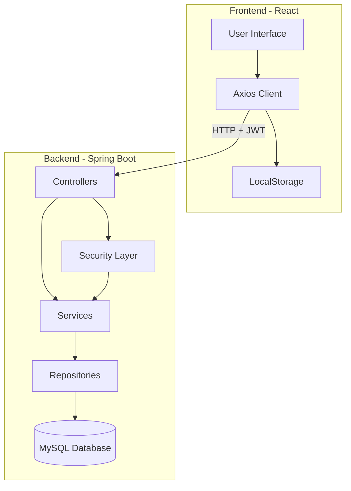
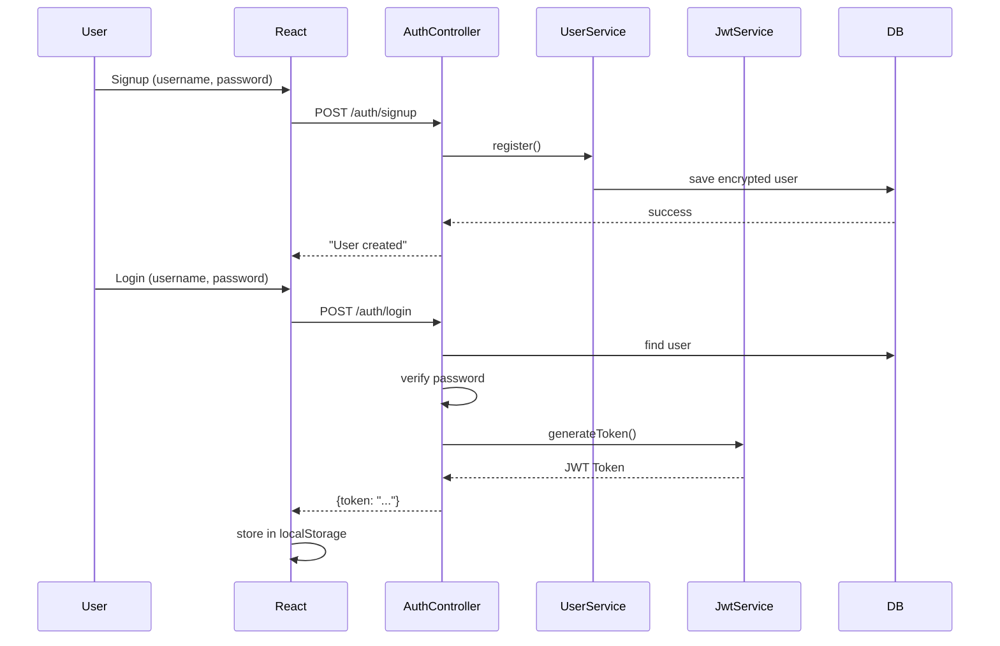
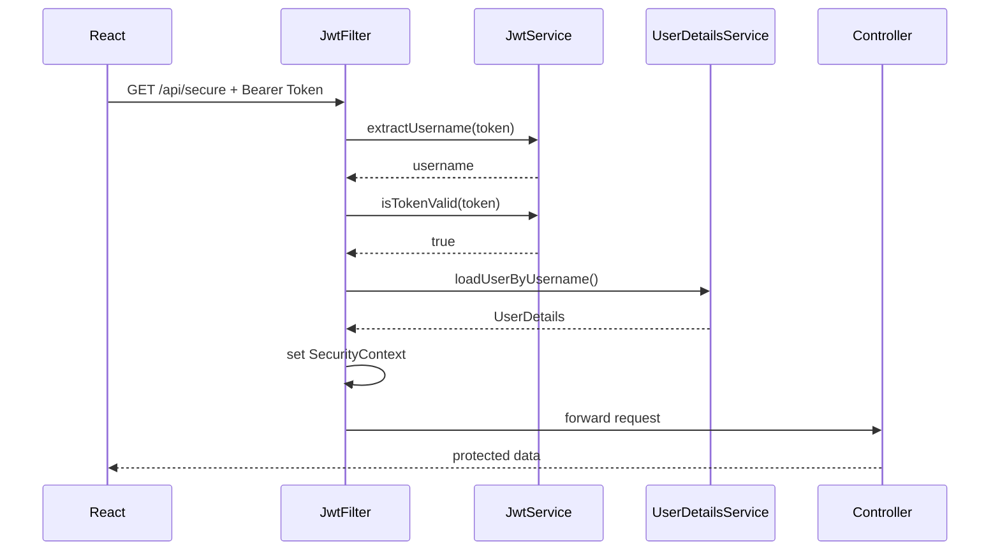

# Design Document

## Overview

Ce document décrit l'architecture et la conception détaillée du système d'authentification JWT avec Spring Boot et React. Le système suit une architecture client-serveur avec authentification stateless basée sur JWT, séparation claire des responsabilités, et communication REST API.

## Architecture

### Architecture Globale



### Flux d'Authentification



### Flux de Requête Protégée



## Components and Interfaces

### Backend Components

#### 1. Entity Layer

**User.java**
- Représente l'entité utilisateur en base de données
- Attributs: id (Long), username (String, unique), password (String, encrypted)
- Annotations JPA: @Entity, @Table, @Id, @GeneratedValue, @Column

#### 2. Repository Layer

**UserRepository.java**
- Interface JpaRepository<User, Long>
- Méthodes:
  - `Optional<User> findByUsername(String username)` - recherche par username
  - `boolean existsByUsername(String username)` - vérification d'existence

#### 3. DTO Layer

**SignupRequest.java**
- Champs: username (String), email (String), password (String)
- Validation: @NotBlank sur tous les champs

**AuthRequest.java**
- Champs: username (String), password (String)
- Validation: @NotBlank sur tous les champs

**AuthResponse.java**
- Champs: token (String)
- Retourné après login réussi

#### 4. Service Layer

**UserService.java**
- Dépendances: UserRepository, PasswordEncoder
- Méthodes:
  - `User register(String username, String rawPassword)` - crée un utilisateur avec mot de passe crypté
  - Vérifie l'unicité du username
  - Lance RuntimeException si username existe déjà

#### 5. Security Layer

**JwtService.java**
- Gère la génération et validation des JWT
- Configuration: secret key (HMAC-SHA256), expiration (24h)
- Méthodes:
  - `String generateToken(String username)` - génère un JWT signé
  - `String extractUsername(String token)` - extrait le username du token
  - `boolean isTokenValid(String token)` - valide signature et expiration
  - `Claims parseClaims(String token)` - parse et valide le token

**CustomUserDetailsService.java**
- Implémente UserDetailsService de Spring Security
- Méthode: `UserDetails loadUserByUsername(String username)`
- Charge l'utilisateur depuis la DB et le convertit en UserDetails Spring Security

**JwtAuthenticationFilter.java**
- Extends OncePerRequestFilter
- Intercepte chaque requête HTTP
- Logique:
  1. Extrait le header "Authorization"
  2. Vérifie le format "Bearer {token}"
  3. Valide le token via JwtService
  4. Charge UserDetails via CustomUserDetailsService
  5. Configure le SecurityContext avec l'authentification
  6. Passe la requête au filtre suivant

#### 6. Configuration Layer

**SecurityConfig.java**
- Configuration Spring Security
- Beans:
  - `SecurityFilterChain` - configure les règles de sécurité
  - `PasswordEncoder` - BCryptPasswordEncoder
- Configuration:
  - CSRF désactivé (stateless)
  - Session stateless
  - Endpoints /auth/** publics
  - Tous les autres endpoints nécessitent authentification
  - JwtAuthenticationFilter ajouté avant UsernamePasswordAuthenticationFilter
  - CORS configuré pour accepter le frontend

#### 7. Controller Layer

**AuthController.java**
- Endpoints publics d'authentification
- Dépendances: UserService, UserRepository, PasswordEncoder, JwtService
- Endpoints:
  - `POST /auth/signup` - inscription
    - Valide SignupRequest
    - Vérifie unicité username
    - Appelle UserService.register()
    - Retourne "User created" ou erreur
  - `POST /auth/login` - connexion
    - Valide AuthRequest
    - Recherche utilisateur par username
    - Vérifie mot de passe avec PasswordEncoder
    - Génère JWT via JwtService
    - Retourne AuthResponse avec token ou 401

**TestController.java**
- Endpoint protégé pour tester l'authentification
- Endpoint:
  - `GET /api/secure` - retourne un message si authentifié

### Frontend Components

#### 1. API Configuration

**api.js**
- Configuration Axios avec baseURL (http://localhost:8080)
- Intercepteur de requête:
  - Récupère le token depuis localStorage
  - Ajoute automatiquement le header "Authorization: Bearer {token}"
- Export d'une instance Axios configurée

#### 2. Authentication Components

**Signup.js**
- Formulaire d'inscription
- State: username, email, password
- Fonction signup():
  - POST /auth/signup avec les données
  - Affiche succès ou erreur via alert

**Login.js**
- Formulaire de connexion
- Props: onLoginSuccess (callback)
- State: email, password
- Fonction login():
  - POST /auth/login avec credentials
  - Stocke le token dans localStorage
  - Appelle onLoginSuccess() pour mettre à jour l'état de l'app

**Home.js**
- Page protégée accessible après authentification
- State: message
- Fonction getSecureData():
  - GET /api/secure avec token automatique
  - Affiche la réponse ou erreur

#### 3. Main Application

**App.js**
- Gère l'état d'authentification global
- State: isLogged (basé sur présence du token dans localStorage)
- Affiche conditionnellement:
  - Si non connecté: Signup + Login
  - Si connecté: Home + bouton Déconnexion
- Fonction logout:
  - Supprime le token de localStorage
  - Met à jour isLogged à false

## Data Models

### User Entity

```java
@Entity
@Table(name = "users")
public class User {
    @Id
    @GeneratedValue(strategy = GenerationType.IDENTITY)
    private Long id;
    
    @Column(unique = true, nullable = false)
    private String username;
    
    @Column(nullable = false)
    private String password; // BCrypt encrypted
}
```

### JWT Token Structure

```json
{
  "sub": "username",
  "iat": 1234567890,
  "exp": 1234654290
}
```

- **sub**: Subject (username de l'utilisateur)
- **iat**: Issued At (timestamp de création)
- **exp**: Expiration (iat + 24 heures)
- **Signature**: HMAC-SHA256 avec secret key

### API Request/Response Models

**Signup Request**
```json
{
  "username": "john_doe",
  "email": "john@example.com",
  "password": "securePassword123"
}
```

**Login Request**
```json
{
  "username": "john_doe",
  "password": "securePassword123"
}
```

**Login Response**
```json
{
  "token": "eyJhbGciOiJIUzI1NiIsInR5cCI6IkpXVCJ9..."
}
```

## Error Handling

### Backend Error Handling

#### Authentication Errors
- **Username déjà pris**: 400 Bad Request avec message "Username already taken"
- **Credentials invalides**: 401 Unauthorized avec message "Invalid credentials"
- **Token expiré**: 401 Unauthorized (géré par JwtService)
- **Token invalide**: 401 Unauthorized (géré par JwtService)

#### Validation Errors
- **Champs vides**: 400 Bad Request (validation @NotBlank)
- **Format invalide**: 400 Bad Request (validation Spring)

#### Exception Handling Strategy
- RuntimeException pour erreurs métier (username exists)
- Spring Security gère automatiquement les 401/403
- JwtAuthenticationFilter catch les exceptions JWT et continue sans authentification
- Pas de stack trace exposé au client

### Frontend Error Handling

#### API Call Errors
- Try-catch sur tous les appels API
- Affichage d'alertes utilisateur en cas d'erreur
- Messages génériques pour éviter la fuite d'information

#### Token Management
- Vérification de présence du token avant accès aux pages protégées
- Suppression du token en cas d'erreur 401
- Redirection vers login si token absent ou invalide

## Testing Strategy

### Backend Testing

#### Unit Tests
- **UserService**: 
  - Test création utilisateur avec password encryption
  - Test détection username duplicate
- **JwtService**:
  - Test génération token avec claims corrects
  - Test validation token valide
  - Test rejet token expiré
  - Test rejet token avec signature invalide
- **CustomUserDetailsService**:
  - Test chargement utilisateur existant
  - Test exception pour utilisateur inexistant

#### Integration Tests
- **AuthController**:
  - Test signup avec données valides
  - Test signup avec username existant
  - Test login avec credentials valides
  - Test login avec credentials invalides
- **Security Configuration**:
  - Test accès public à /auth/**
  - Test protection des endpoints /api/**
  - Test validation JWT sur endpoints protégés

### Frontend Testing

#### Component Tests
- **Login**: Test soumission formulaire et stockage token
- **Signup**: Test soumission formulaire et gestion erreurs
- **Home**: Test appel API protégée avec token
- **App**: Test navigation conditionnelle basée sur authentification

#### Integration Tests
- Test flux complet: signup → login → accès page protégée → logout
- Test gestion erreurs réseau
- Test expiration token et redirection

### Manual Testing Checklist
1. Créer un compte via /auth/signup
2. Se connecter via /auth/login et vérifier réception du token
3. Accéder à /api/secure avec token valide
4. Tenter d'accéder à /api/secure sans token (doit échouer)
5. Tenter d'accéder à /api/secure avec token expiré (doit échouer)
6. Se déconnecter et vérifier suppression du token
7. Vérifier CORS entre frontend et backend

## Configuration

### Backend Configuration (application.properties)

```properties
# Database
spring.datasource.url=jdbc:mysql://localhost:3306/jwt_db?useSSL=false&serverTimezone=UTC
spring.datasource.username=root
spring.datasource.password=
spring.jpa.hibernate.ddl-auto=update
spring.jpa.show-sql=true

# JWT
jwt.secret=replace_this_with_a_long_random_secret_key_at_least_32_chars
jwt.expiration-ms=86400000

# Server
server.port=8080
```

**Notes de sécurité**:
- jwt.secret doit être une clé aléatoire d'au moins 32 caractères
- En production, utiliser des variables d'environnement ou un vault
- Changer les credentials de base de données

### Frontend Configuration

- **API Base URL**: http://localhost:8080 (configurable dans api.js)
- **Token Storage**: localStorage (clé: "token")
- **CORS Origin**: http://localhost:3000

## Security Considerations

### Backend Security
1. **Password Encryption**: BCrypt avec salt automatique
2. **JWT Signature**: HMAC-SHA256 avec secret key
3. **Stateless Sessions**: Pas de session côté serveur
4. **CSRF Protection**: Désactivé (approprié pour JWT stateless)
5. **CORS**: Configuré pour accepter uniquement le frontend origin
6. **Token Expiration**: 24 heures (configurable)

### Frontend Security
1. **Token Storage**: localStorage (alternative: httpOnly cookies pour plus de sécurité)
2. **Automatic Token Injection**: Via intercepteur Axios
3. **No Token Exposure**: Token jamais affiché dans l'UI
4. **Logout**: Suppression complète du token

### Recommendations
- Utiliser HTTPS en production
- Implémenter refresh tokens pour sessions longues
- Ajouter rate limiting sur endpoints d'authentification
- Logger les tentatives de connexion échouées
- Implémenter un système de rôles/permissions
- Considérer httpOnly cookies au lieu de localStorage pour le token
